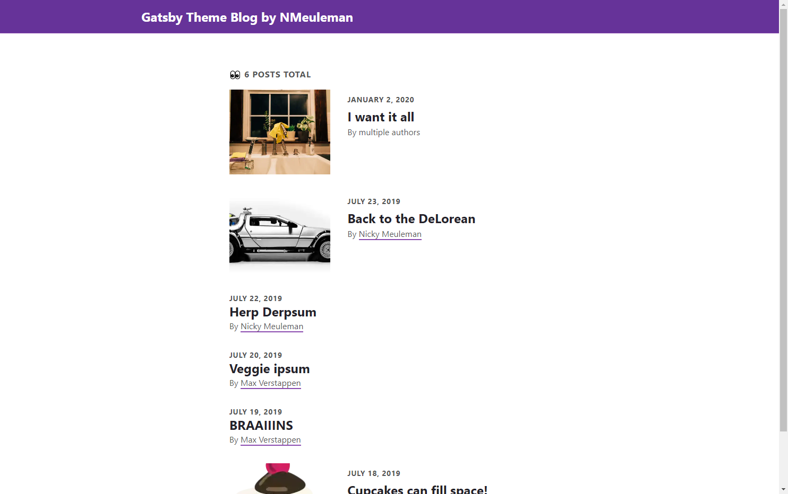
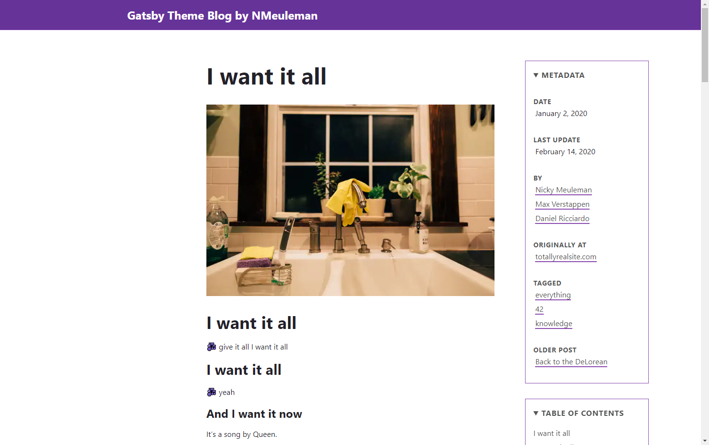

# @nickymeuleman/Gatsby Theme Blog

A Gatsby theme for creating a blog.
Check out [the live demo](https://gatsby-theme-nicky-blog.netlify.com/).

The default styling with a list of blogposts looks like this:


And the default styling for a single blogost:


## What you get from this theme

- A plug and play feature rich blog platform

## Installation

To use this theme in your Gatsby sites:

1.  Install the theme

    ```sh
    npm install --save @nickymeuleman/gatsby-theme-blog
    ```

1.  Add the theme to your `gatsby-config.js`:

    ```js
    module.exports = {
      plugins: ["@nickymeuleman/gatsby-theme-blog"],
    }
    ```

1.  Start your site

    ```sh
    gatsby develop
    ```

1.  Add an `authors` file and create a post! [Instructions/details in the Usage section](#usage)

## Usage

### Theme options

| Key           | Default value   | Description                                                                                  |
| ------------- | --------------- | -------------------------------------------------------------------------------------------- |
| `basePath`    | `""`            | Root url for all blog posts                                                                  |
| `contentPath` | `"data/posts"`  | Folder Location to house individual blog post-folders                                        |
| `assetPath`   | `"data/assets"` | Folder location to house extra assets (like the [author](#anatomy-of-an-authors-file) file.) |
| `pagination`  | `undefined`     | Optional object, enables pagination if provided                                              |

#### `pagination` options

| Key            | Default value | Description                                                    |
| -------------- | ------------- | -------------------------------------------------------------- |
| `postsPerPage` | `6`           | Amount of posts per paginated page                             |
| `prefixPath`   | `""`          | Optional string. Path for paginated pages: eg: `/prefixPath/2` |

### Example usage

```js
// gatsby-config.js
module.exports = {
  plugins: [
    {
      resolve: "@nickymeuleman/gatsby-theme-blog",
      options: {
        contentPath: "posts",
        basePath: "blog",
        pagination: {
          postsPerPage: 10,
          prefixPath: "page",
        },
      },
    },
  ],
}
```

### Additional configuration

In addition to the theme options, there are a handful of items you can customize via the `siteMetadata` object in your site's `gatsby-config.js`

```js
// gatsby-config.js
module.exports = {
  siteMetadata: {
    // Used for the site title, SEO, and header component title.
    title: `My Blog Title`,
    // Used for SEO
    description: `My site description...`,
    // Used for SEO and as default if an author has no twitter defined
    social: {
      twitter: `@NMeuleman`,
    },
  },
}
```

### Adding blog posts

In the folder that was created for the `contentPath` (`content` by default). Create a folder to hold a blog post. Unless a [slug](#anatomy-of-a-blogpost) is provided, the title of this folder will serve as the slug for the blogpost.
Inside that folder, an `index.mdx` or `index.md` file will be the blog post itself. Along this file can be several different files specific to that blogpost (e.g. images)
If no [date](#anatomy-of-a-blogpost) is specified, the date the `.md(x)` file was created will serve as the date for the blogpost.

> NOTE: If you dislike having a folder per blogpost, loose `.md(x)` files are also supported. Place them inside the folder created for `contentPath`.
> The title of the file will then serve as the slug of the blogpost if a slug not specified in the post's [slug](#anatomy-of-a-blogpost) field.

### Example folder tree

<!-- prettier-ignore-start -->
```
.
└── data
    ├── assets
    │   ├── authors.json
    │   └── image-used-often.jpg
    └── posts
        ├── my-first-post
        │   ├── index.mdx
        │   ├── coverPhoto.jpg
        │   ├── boop.png
        │   └── infinite-boop.gif
        └── my-second-post
            ├── index.md
            ├── f1-car.jpg
            └── speed-data.svg
```
<!-- 
# data
## assets
### authors.json 
### image-used-often.jpg
## posts
### my-first-post
#### index.mdx
#### coverPhoto.jpg
#### boop.png
#### infinite-boop.gif
### my-second-post
#### index.md
#### f1-car.jpg
#### speed-data.svg
-->
<!-- prettier-ignore-end -->

### Adding authors

In the folder that was created for the `assetPath` (`assets` by default). Create a file called `authors.json` or `authors.yaml`. This file (or files, both formats can work together) holds an array of author objects.

#### Anatomy of an authors file

An authors file contains a top level array filled with object describing individual authors.
An author can have several different field with information specific to them.

| Key         | Value  | Required | Description                                                                 |
| ----------- | ------ | -------- | --------------------------------------------------------------------------- |
| `shortName` | string | yes      | **unique** identifier for the author, used in `author` field for blog posts |
| `name`      | string | yes      | full name eg. "Nicky Meuleman"                                              |
| `twitter`   | string | no       | twitter handle without @                                                    |

#### Anatomy of a blogpost

The blogpost itself (`.md` or `.mdx` file for now, others coming soon) can have several different fields with extra information.
In `.md` or `.mdx` files these fields are set via the frontmatter.

| Key            | Value                        | Required | Description                                                                        |
| -------------- | ---------------------------- | -------- | ---------------------------------------------------------------------------------- |
| `title`        | string                       | no       | title of your blogpost                                                             |
| `date`         | date string                  | no       | the date tied to the post                                                          |
| `canonicalUrl` | full url string              | no       | Canonical url                                                                      |
| `authors`      | array of `shortName` strings | no       | Authors of the post. <br/>Should not be used in combination with the `author` key. |
| `author`       | `shortName` string           | no       | Author of the post. <br/>Should not be used in combination with the `authors` key. |
| `tags`         | array of tag strings         | no       | tags for this post                                                                 |
| `keywords`     | array of keyword strings     | no       | keywords for SEO                                                                   |
| `cover`        | relative path to cover image | no       | displayed as cover image, in social cards                                          |
| `published`    | boolean, defaults to `true`  | no       | include post in production                                                         |
| `slug`         | string                       | no       | the last part of the URL for this post                                             |

### Exported components

The included components are larely unstyled implementations to show an example of what is possible.
Overwriting these with your own is highly encouraged. This can be done via [component shadowing](https://www.gatsbyjs.org/blog/2019-04-29-component-shadowing/).

#### List of components:

- BlogList
- BlogPost
- Pagination
- PostCard
- TagList
- TagPage
- PostExtra
- Every component from [Gatby-mdx-embed](https://github.com/PaulieScanlon/gatsby-mdx-embed)
- Aside

#### Components that are usable in `.mdx` without importing them first

- Every component from [Gatby-mdx-embed](https://github.com/PaulieScanlon/gatsby-mdx-embed)
- Aside

To add to this list, shadow `@nickymeuleman/gatsby-theme-blog/components/mdx-components`.
Every component that is exported as a named export will be available for use in `.mdx` under that name, without importing it first.

example declaration of a `<Shia />` component

```js
// in src/@nickymeuleman/gatsby-theme-blog/components/mdx-components/index.js
import React from "react"
export * from "@nickymeuleman/gatsby-theme-blog/src/components/mdx-components/index"
const Shia = ({ children }) => (
  <p>Don't let your dreams be dreams! {children}</p>
)
export { Shia }
```

example usage in an `.mdx` file

```
# Shia LaBeouf says:

<Shia>
  Just do it!
</Shia>
```

#### List of layout style related components

- Header
- layout
- Main

#### How to shadow components

If you want to use [component shadowing](https://www.gatsbyjs.org/blog/2019-04-29-component-shadowing/), create a file at the following path in your site:

```
src/@nickymeuleman/gatsby-theme-blog/components/<component-name>.js
```

#### Example usage in MDX

In any MDX blogpost:

<!-- prettier-ignore-start -->
```mdx
import { ComponentName } from "@nickymeuleman/gatsby-theme-blog"
---
<frontmatter-fields>
---

# Lorem Ipsum
<ComponentName />
```
<!-- prettier-ignore-end -->

> Components from [Gatby-mdx-embed](https://github.com/PaulieScanlon/gatsby-mdx-embed) can be used without first importing them

#### Example usage in React components

In any React component:

```jsx
import React from "react"
import { ComponentName } from "@nickymeuleman/gatsby-theme-blog"

export default () => (
  <div>
    <ComponentName />
  </div>
)
```

### dev notes

- [ ] 🚧 👷 Multi sourcing
- [ ] revamp way slugs are handled
- [x] code blocks
  - [ ] Look into code blocks that pass contrast checks https://github.com/system-ui/theme-ui/issues/564
- [x] some light styling? (future Nicky notes: That ended up being more than light.)
  - [x] redo styles with theme-ui, like `<li>` margins?
- [ ] css reset?
- [ ] rss feed?
- [ ] offline, manifest, ...?
- [ ] icons (default icon for SEO if no fitting image found)
  - [ ] icons for tags?
  - [x] look into https://zeit.co/blog/social-og-image-cards-as-a-service
- [x] canonical url support:
  - [x] functionality works, now add docs
  - [x] add a "originally published at" line to blogpost component
- [x] multiple authors support
  - [x] multiple authors per post
  - [ ] avatar for each author, because, pretty pictures are tight (watch @theryangeorge)
  - [x] rename "author" in graphql to "authors", it's an array
- [x] revamp how SEO component works
  - [x] migrate from Helmet props to nested html tags?
  - [ ] pass less props into SEO component
- [ ] Document what tasks individual components perform, how ones include others
- [x] make tags array optional
  - [x] cannot return null for non-nullable field MdxTag.id
- [x] published frontmatter field.
  - ~~[ ] option to hide unpublished articles when running "gatsby develop"?~~ hidden in blog list, individual pages exist.
- [x] different content folder for authors? (maybe together with images etc that are not directly tied to a single blogpost)
- [x] Ability to specify path in frontmatter. See: https://github.com/gatsbyjs/gatsby/pull/16611
- [x] Double images when linked like `` in mdx. Blurry and fullsize.
  - Eventual fix https://github.com/gatsbyjs/gatsby/issues/16242
  - temporary fix: add `plugins` instead of `gatsbyRemarkPlugins`
- [x] Add link icons next to headings via: https://theme-ui.com/recipes/linked-headings/
  - note: Why was this better than `gatsby-remark-autolink-headers` again? Saw it in a GitHub issue somewhere
  - https://github.com/ChristopherBiscardi/gatsby-mdx/issues/204 and https://github.com/gatsbyjs/gatsby/pull/14520
- [x] Refactor theme options to use defaults if not specified to avoid repeating yourself. See: https://github.com/gatsbyjs/gatsby/blob/master/themes/gatsby-theme-blog-core/utils/default-options.js
- [x] Make the date of blogposts default to the time the file was created in case the date frontmatter field was not specified.
- [x] Make title of blogposts default to the unkebabcased title of the folder.
- [x] Allow unkebabcased slugs in frontmatter
- [x] Allow blog posts as plain markdown/mdx files, not in a folder
- [x] document loose files as blogposts
- [x] Allow author field in frontmatter to be optional
  - [x] allow for authorless posts
- [ ] Make demo website function like a big readme.
- [ ] https://github.com/gatsbyjs/gatsby/pull/16149 got merged, use it.
- [ ] https://github.com/gatsbyjs/gatsby/pull/17284 got merged, use it.
- [x] Migrate theme to TypeScript, leave demo as JavaScript
- [x] Add testing with react-testing-library and cypress
  - [ ] Actually add tests once the scaffolding is done
  - [ ] Use something like codecov to ensure test coverage
- [ ] Social share images
      Research: - https://github.com/zeit/og-image - https://lannonbr.com/blog/2019-11-10-og-images/ - https://github.com/ChristopherBiscardi/gatsby-plugins/tree/master/packages/gatsby-plugin-printer - https://www.learnwithjason.dev/blog/auto-generate-social-image/ - https://github.com/jlengstorf/get-share-image - https://www.swyx.io/writing/jamstack-og-images/ - https://aless.co/gatsby-wasm-plugin/ - https://github.com/alessbell/gatsby-remark-twitter-cards - https://andrewingram.net/posts/automatic-social-cards-with-gatsby/ - https://github.com/syntra/gatsby-remark-social-cards > twitter card-size image (630 x 1200 px) > from: Andres Ingram link > `// Set the viewport to the desired dimensions of the image` > `await page.setViewport({ width: 2048, height: 1170 });`
      personal note: analysis paralysis is real
- [x] Components in .mdx 🚧
      Like this `<Aside>` https://github.com/jlengstorf/learnwithjason.dev/blob/master/site/src/components/aside.js
      also `<YouTube>`, `<Twitter>`, `<CodeSandbox>` etc.
      maybe use https://github.com/MichaelDeBoey/gatsby-remark-embedder for part of those embeds.
      https://github.com/PaulieScanlon/gatsby-mdx-embed is in line with original idea of creating the components myself.
      Implemented.
      Caused some issues: detailed https://github.com/PaulieScanlon/gatsby-mdx-embed/issues/11
- [x] Migrate to theme-ui v0.3
- [x] Rename Underpost to PostExtra
- [x] Rework default `contentPath` and `assetPath`
- [x] Remove duplicate remark images plugin
- [ ] Page per author
- [ ] Avatar support for authors
- [ ] CLI to scaffold out now blogposts (See how Kyle Shevlin does this.)
- [ ] theme border values. Only take the sharp edge off, don't round too much.
- [ ] add support for updating blogposts (updatedAt frontmatter field?)
- [ ] Rework how cards are done `BlogList` https://inclusive-components.design/cards/
- [ ] Use [inversion of control](https://kentcdodds.com/blog/inversion-of-control/) and [component composition](https://youtu.be/3XaXKiXtNjw) more.
  - eg. Using `props.children` inside the `PostExtra` component.
